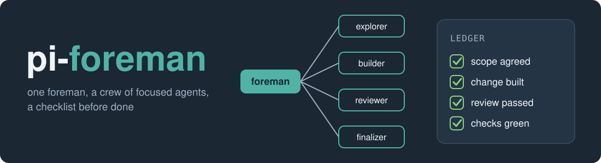

<p>
  
</p>

# pi-foreman

pi-foreman turns the [pi coding agent](https://pi.dev) into a small crew. You talk to one session, the
"foreman". It does not rush into editing your files. It sizes the task, writes down a checklist, hands the
work to focused helper agents (one explores, one builds, one reviews), checks what they bring back, and only
says "done" when the checklist is ticked and a reviewer has passed the change.

What that gives you: fewer wrong edits, a second pair of eyes before anything is called finished, guard rails
around git and the shell, a cost footer so you see what a task used, and the chance to use cheaper models for
the helpers while a stronger one stays in charge.

## Requirements

Node 22+, Pi 1.1.x on your `PATH`, Python 3.9+. Linux, macOS and Windows.

## Install

```sh
git clone https://github.com/Shredi/pi-foreman.git && cd pi-foreman && node setup.mjs
```

`node setup.mjs --dry-run` shows what it would change and writes nothing. Map your models in
`foreman.json`: see [install](docs/install.md).

## First session

1. Start `pi` in a repository.
2. Type a task, for example "add a --verbose flag to the CLI".
3. Watch the foreman pick a tier (trivial, standard or heavy), launch a builder, then a reviewer, and tick its
   checklist as the work is verified. A footer shows tokens and cost.
4. Type `/foreman close` to end the session cleanly.

## Learn more

| Page | What is in it |
|---|---|
| [docs/install.md](docs/install.md) | Installer flags, config layers, updating Pi, Claude bridge login |
| [docs/roles.md](docs/roles.md) | Roles, model ladder, rank policy, presets |
| [docs/ceremony.md](docs/ceremony.md) | Tiers, review and finish gates, planning, budgets |
| [docs/safety.md](docs/safety.md) | Shell and git guards, PR gate, permissions, known limits |
| [docs/sessions.md](docs/sessions.md) | `/sync`, `/retro`, `/foreman close`, `/foreman session`, intercom, Herdr |
| [docs/bench.md](docs/bench.md) | Measuring the harness with `foreman bench` |
| [docs/overlays.md](docs/overlays.md) | Private and organisation overlays |
| [docs/development.md](docs/development.md) | Layout, tests, CI, working on pi-foreman |
| [design/architecture.md](design/architecture.md) | The design record and rationale |
| [CHANGELOG.md](CHANGELOG.md) | What changed |

## License

MIT, see `LICENSE`. Upstream attributions are in `NOTICE`.
